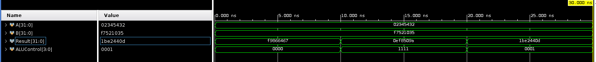

# SUPERSCALER_RISC-V_CORE
Added an superscaler implementation of ALU that can help with parallel computation for encryption.
The main ALU supports 32 operations while the slave ALU-cluster supports only MUL and ADD operations, as per the need of the application. We have implemented Full Custom flow with custom memory design using Cadence FreePDK45

Our application showcases a device granting sudo access only when correct username and password are provided.
If the system moves beyond Instruction 10, the sudo access is granted to the user.

Clearly our model decreases the latency 8x times for the encryption algorithms showcased. For example, a simple 10 digit encryption tester using *ADD, MUL, SUB* is shown below:

The superscaler instructions are as follows
- 1. Fill Register 1 with Immediate value for Admin Key
- 2. Store the Admin key to Memory
- 3. Fill Register 5 with Immediate value for passkey
- 4. Store the desired passkey for sudo access, in memory
- 5. Load the Public Key in Register 1 (Username)
- 6. Load the Private Key in Register 2 (Password)
- 7. Superscaler MUL for Reg1 and Reg2, writeback in Register 3
- 8. Load the Admin key from memory to Register 4
- 9. Superscaler ADD for  Reg3 and Reg4, write back in Reg3
- 10. Compare Reg5 and Reg3 and branch to Instr 5 if NEQ (attempt for the password again...)
- 11-15. Random Instructions (Showcasing the CPU's other capablitites based on user inputs)
- 16. Load Memory address 100 with 32-bit decimal value 25 to kill the system. 

## Design Architecture
-1.SimTop - Contains the complete CPU unit with Clock and Reset signals being the inputs.
-1.1. Instr_Memory - ROM for reading the program instructions
-1.2. Reg_Memory -   On-Chip Register unit(DRAM) for directly handling volatile data
-1.3. Data_Memory -  Main Memory on System(SRAM)
-1.4. Control_Path - Architecture for how the Control signals flow through various components
-1.4.1 ALU_Decoder -  Decodes which operation needs to be performed through the ALU
-1.4.1 Main_Decoder - Decodes which type of operation/load/read/write operation needs to be performed through the system
-1.5. Data_Path -    Architecture for how the data flows through various components
-1.5.1 PC_Unit -      Determines the next Program Pointer Value to run the next set of instructions.
-1.5.2 ALU_Unit -     Contains both the ALUs, their supplimentry units and the logic used to activate the required ALU unit.
-1.5.3 Write_Back -   MUX logic to determin the data to be written back to register
-1.5.4 Ext_Unit -     Extend and/or Immediate Units for the CPU.

Current implementation is single-cycle. WIP for pipelined architecture...
