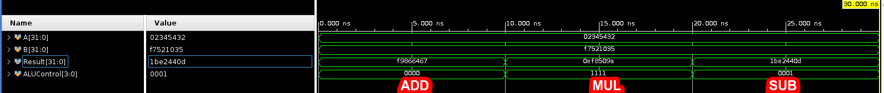
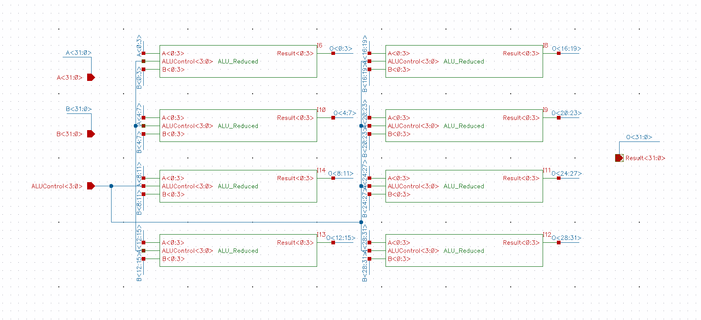
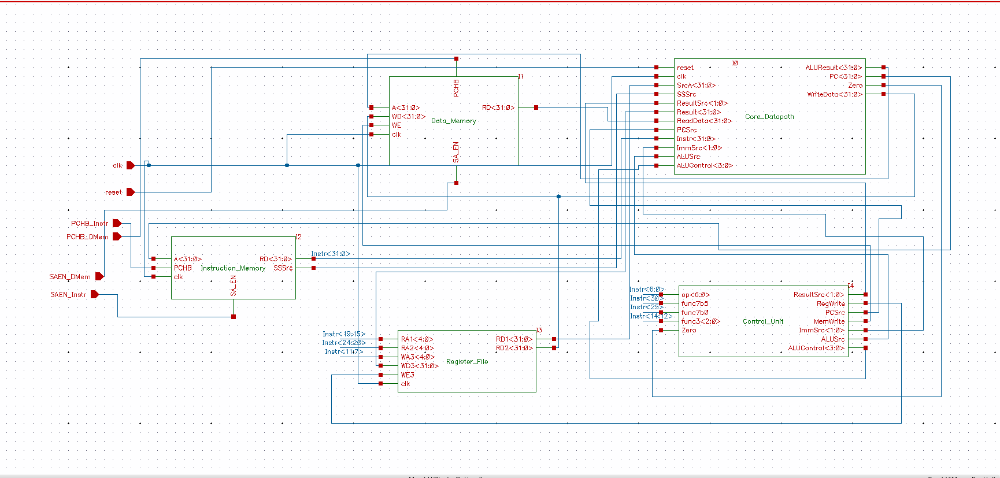
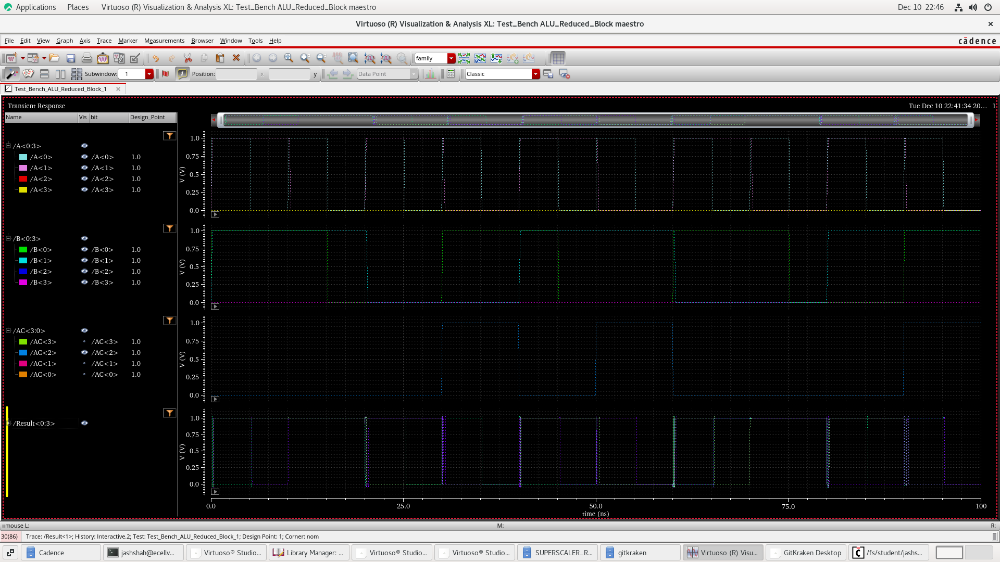

# Superscaler RISC-V Core For Encryption

Implemented the full custom superscaler implementation of ALU that can help with parallel computation for encryption.
The main ALU supports 32 operations while the slave ALU-cluster supports only MUL, SUB and ADD operations, as per the need of the application. 
We have implemented Full Custom flow with custom memory design using Cadence FreePDK45. 

The CPU unit developed, has "clk", "reset", "Read_Enable" and "Precharge_Enable" signals as the input (should be coming from the upper software/firmware layers ). The Memory is a share unit between the CPU and the other peripherals, so all the data required for the peripheral system should be stored in the memory, which also serves as the system's output.

Our application showcases a device granting sudo access only when correct username and password are provided.
If the system moves beyond Instruction 10, the sudo access is granted to the user.

Clearly our model decreases the latency 8x times for the encryption algorithms showcased. For example, a simple 10 digit encryption tester using *ADD, MUL, SUB* is shown below:

A better understanding of the Custom Design is shown in the Cadence Design Image below:

## Design Architecture
SimTop - Contains the complete CPU unit with Clock and Reset signals being the inputs.
- 1. Instr_Memory - ROM for reading the program instructions
- 2. Reg_Memory -   On-Chip Register unit(DRAM) for directly handling volatile data
- 3. Data_Memory -  Main Memory on System(SRAM)
- 4. Control_Path - Architecture for how the Control signals flow through various components
  - 1. ALU_Decoder -  Decodes which operation needs to be performed through the ALU
  - 2. Main_Decoder - Decodes which type of operation/load/read/write operation needs to be performed through the system
- 5. Data_Path -    Architecture for how the data flows through various components
  - 1 PC_Unit -      Determines the next Program Pointer Value to run the next set of instructions.
  - 2 ALU_Unit -     Contains both the ALUs, their supplimentry units and the logic used to activate the required ALU unit.
  - 3 Write_Back -   MUX logic to determin the data to be written back to register
  - 4 Ext_Unit -     Extend and/or Immediate Units for the CPU. 

**The System Architecture Schematic is shwon below:**

**And the upper level block of the custom design is shown below:**

## Implemented Instructions
- R-Type - ADD, ADDI, SUB, SLT, SLTU, XOR, SRL, SRA, OR, AND
- I-Type - LB, LH, LW, LBU, LHU, ADDI, SLTI, SLTIU, XORI, ORI, ANDI, SLLI, SRLI, SRAI
- S-Type - SB, SH, SW
- B-Type - BEQ, BNE
- U-Type - LUI, AUIPC

## Program Architecture
All keys being used in the program are 8 hex-digit long. 
Admin Key -- Key used once the user enters Username and Password -- [ 1 1 1 1 1 1 1 1 ]
Public Key -- Username -- [ 0 2 3 4 5 4 3 2 ]
Private Key -- Password -- [ F 7 4 2 1 0 3 5 ]
Passkey -- The encrypted combination stored in the memory -- [ 1 F D 9 6 1 A B ]

Admin Key is pre-stored in the Memory address 0
System Memory Config('d25) is already stored in Register 0.

**Instruction Set**:

- Load the Passkey into the memory as soon as system boots up
1. LUI x1 0x1FD96
2. ADDI x1 x1 0x1AB
3. LUI x2 0x00000
4. SW x1 4(x2)

- Random Operation simulated while system bootup process, which can randomly change all values stored in temporary registers
5. SLT x1 x1 x2

- System starts up and User gets a prompt to enter username and password.
6. LUI x3 0x02345
7. ADDI x3 x3 0x432
8. LUI x4 0xF7421
9. ADDI x4 x4 0x035

- Superscaler Element-wise Multiplication for encryption purpose
10. *MUL x3 x3 x4

- Load the Admin Key from the system 
11. LW x4 0(x2)

- Superscaler Elemnet-wise  Addition for the encryption purpose
12. *ADD x3 x3 x4

- Load the saved Passkey from the memory for comparision. Jump to Exit instruction if the username and password match...
13. LW x1 4(x2)
14. BEQ x1 x3 8

- If the username and password are not correct, we store value 'd50 in exit register, raising an interrupt in the system.
15. ADDI x0 x0 0x19

- Exit code for the system is when 100th byte of the D_Mem gets the value "25".
16. SW x0 100(x2)

**Fully functional system waveforms are as shown below:**

## Design validation
The image below shows a multiplication circuit's simulation results to validate the choice of design parameters. 
Detailed analysis can be found in the presentation slides included with this repo -  and .

---

Current implementation is single-cycle. WIP for pipelined architecture...

The reports and design presentations have been uploaded in the supplimentry materials folder. The project was completed within an ambitious target of 2 weeks. If you find some issues/have some questions, feel free to contact the developers by dropping us a mail at .
**Please leave a ⭐ if you found the work helpful**
